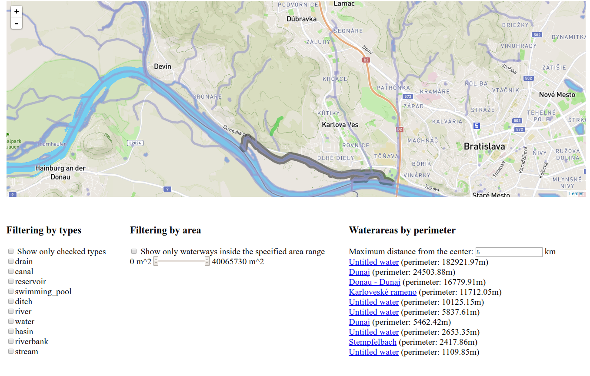

# Overview

This application shows waterways and waterareas in the west of Slovakia on a map. Most important features are:
* displaying all waterways / waterereas in the viewport by blue color
  * possibility of filtering by area or waterway / waterarea type
* displaying the closest waterway / waterarea to the center of the map by green color
* displaying the list of the ten waterareas with the highest perimeter
  * possibility to limit the distance of search
  * clicking on the item will display the waterarea on the map and highlight it by black color

Queries (? are placeholders for values):
```sql
-- Use cases

SELECT id, name, type, ST_AsGeoJson(wkb_geometry) geometry
FROM geodata
WHERE (0 = ? OR ST_Intersects(wkb_geometry, ST_MakeEnvelope(?, ?, ?, ?, 4326)))
AND (0 = ? OR type = ANY (?))
AND (0 = ? OR ST_Area(ST_TRANSFORM(wkb_geometry, 2163)) >= ?)
AND (0 = ? OR ST_Area(ST_TRANSFORM(wkb_geometry, 2163)) <= ?)

SELECT id, name, type, ST_AsGeoJson(wkb_geometry) geometry
FROM geodata
ST_Distance(wkb_geometry, ST_GeomFromText(?, 4326))
 = (SELECT MIN(ST_Distance(wkb_geometry, ST_GeomFromText(?, 4326))) FROM geodata)
 
WITH perimeters AS (
  SELECT id, ST_Perimeter(ST_TRANSFORM(wkb_geometry, 2163)) perimeter,
         name, type, ST_AsGeoJson(wkb_geometry, 13, 1) geometry
  FROM geodata
  WHERE ST_Distance(ST_TRANSFORM(wkb_geometry, 2163), ST_TRANSFORM(ST_GeomFromText(?, 4326), 2163)) / 1000 <= ?
)
SELECT * FROM perimeters WHERE perimeter > 0 ORDER BY perimeter DESC LIMIT 10

-- Statistics

SELECT DISTINCT(type) FROM geodata

SELECT MIN(ST_Area(ST_TRANSFORM(wkb_geometry, 2163))) min,
       MAX(ST_Area(ST_TRANSFORM(wkb_geometry, 2163))) max
FROM geodata

```

This is it in action:



The application has 2 separate parts, the client which is a [frontend web application](#frontend)
using mapbox API and leaflet.js and the [backend application](#backend) written in Java framework
[Dropwizard](http://www.dropwizard.io/0.9.0/docs/) backed by PostGIS.
The frontend application communicates with backend using a [REST API](#api).

# Frontend

The frontend application is a static HTML page (`index.html`), which shows a leaflet.js widget.
It is displaying waterways and waterareas, thus the map style is based on the Outdoor style.

All relevant frontend code is in `main.js` which is referenced from `index.html`.
The frontend code is very simple, its only responsibilities are:
- detecting user's location, using the standard [web location API](https://developer.mozilla.org/en-US/docs/Web/API/Geolocation/Using_geolocation)
- displaying the filtering controls, driving the user interaction and calling the appropriate backend APIs
- displaying geo features by overlaying the map with a geojson layer, the geojson is provided directly by backend APIs

# Backend

The backend application is written in Dropwizard and is responsible for querying geo data,
formatting the geojson and providing aggregate statistics for filtering controls.

## Data

Hotel data is coming directly from [Mapzen](https://mapzen.com/data/metro-extracts).
I downloaded an extent covering the west of Slovakia (around 196MB). I only used files mapping waterways and waterareas
and imported them using the `osm2osm` tool into the standard OSM schema in WGS 84 with hstore enabled.
To speedup the queries I created an index on geometry column (`geometry`) in all tables.
GeoJSON is generated by using a standard `st_asgeojson` function, however additional data such as name and type is
added so that leaflet's GeoJSON Feature objects could be returned.

## Api

**Find waterways and waterareas inside the rectangle with given search criteria**

`POST http://localhost:9100/service/query`
request content type: JSON
expected request format:
* rectangle - rectangle in which to search
  * point1 - top-left point
    * lat: double - lattitude
    * lng: double - longitude
  * point2 - bottom-right point
    * lat: double - lattitude
    * lng: double - longitude
* types: array[string] - array of allowed types or null for all types
* areaFrom: double - the lowest area to include or null to no filtering from bottom
* areaTo: double - the highest area to include or null to no filtering from top
response content type: JSON
expected response format:
* array
  * type: string = "Feature"
  * properties
    * name: string - name of the waterway / waterarea
    * type: string - type of the waterway / waterarea
  * geometry: geojson

**Get statistics**

`GET http://localhost:9100/service/stats/all`
response content type: JSON
expected response format:
* types: array[string] - all possible waterway / waterarea types
* minArea: double - the lowest area found across all waterways / waterareas
* maxArea: double - the highest area found across all waterways / waterareas
